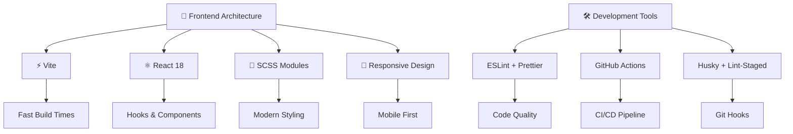
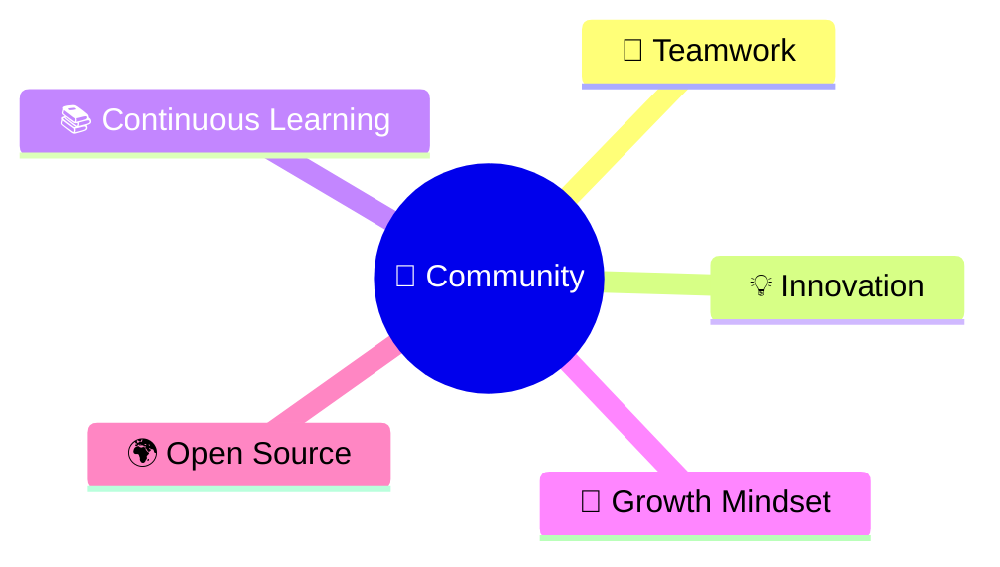

<!-- Animated Tech Header -->
<h1 align="center">
  
</h1>

<!-- Live Demo Badges -->

  
  
  
  

---

## 🛠 Tech Stack Architecture

## 🌍 About ICPC MNU Community  

The **ICPC MNU Community** is more than just a coding club —  
it’s a **collaborative hub** where passionate students from *Menoufia University* come together to:  

- 🏆 **Prepare for ICPC contests** through training, problem solving, and knowledge sharing.  
- 💻 **Build modern tech projects** using **React, Vite, SCSS, and clean code practices**.  
- 🌐 **Promote open-source culture** by contributing to community-driven repositories.  
- 🎓 **Upskill members** with hands-on workshops, peer mentoring, and coding challenges.  
- 📊 **Empower data-driven thinking** and foster innovation across different tech fields.  

---

### 🔥 Our Vision  
To create a **supportive environment** where students collaborate, learn, and compete,  
bridging the gap between **academic knowledge** and **real-world software engineering**.  

---

### 🧩 Community Values  

